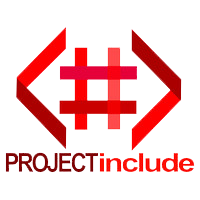

# Project Include Site 2019/2020 

## Site Goals

This is the official Project Include (PI) site for 2019/2020 (redesigned in [Jekyll](http://jekyllrb.com/)) which focuses on the following four objectives:

1. To provide boost credibility, increase stakeholder/partner interest, and increase brand presence
2. To provide a modern UX/UI experience to visitors
3. Introduce Jekyll CMS support for updating posts and site info for non-technical individuals
4. Additional performance improvements to run on lower end hardware

This site is an enhancement of the existing [PI site](https://projectinclude.netlify.com/)

## System Preparation

To use this starter project, you'll need the following things installed on your machine.

1. [Jekyll](http://jekyllrb.com/) - `$ gem install jekyll`
2. [NodeJS](http://nodejs.org) - use the installer.
3. [GulpJS](https://github.com/gulpjs/gulp) - `$ npm install -g gulp` (mac users may need sudo)

## Local Install

1. Open a shell and clone repo via ```git clone https://github.com/ShabazBadshah/project-include-site.git```
2. Change directories to where the repo has been cloned via ```cd /path/to/repo```. This will be your current working directory (CWD).
3. Run ```npm install``` in the CWD. This will install all project dependencies
4. Run ```gulp``` in the CWD. This will run the browser-sync server

## Attributions

- The initial Jekyll site scaffolding and boilerplate was forked from ShakyShane's [jekyll-gulp-sass-browser-sync](https://github.com/shakyShane/jekyll-gulp-sass-browser-sync)
